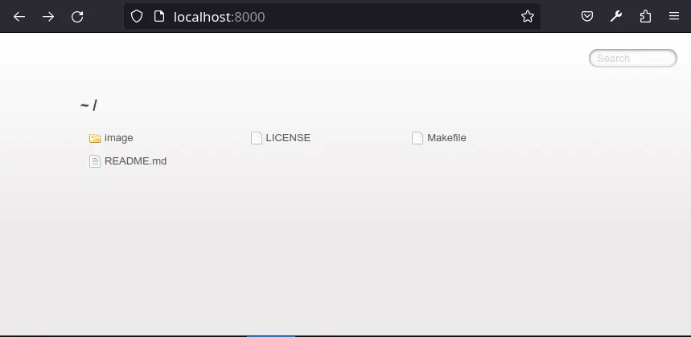

# Hot Reloading Container

A hot reloading container for small web developments.

## Guide

This container is running a server with live reload capabilities using the [live-server](https://www.npmjs.com/package/live-server) package on a base [node:19-alpine](https://hub.docker.com/_/node) image.

If a file ~/.live-server.json exists it will be loaded and used as default options for live-server. See live-server documentation for more information.

An example ~/.live-server.json

```javascript
var liveServer = require("live-server");

var params = {
    // When false, it won't load your browser by default.
    open: false,
    // 0 = errors only, 1 = some, 2 = lots
    logLevel: 2,
    // When set, serve this file (server root relative) for every 404 (useful for single-page applications)
    file: "./index.html"
};
liveServer.start(params);
```

[Makefile](https://makefiletutorial.com/) is used to simplify the commands required for:

*Start the container*

```bash
$ make start
```

*Stop the container*

```bash
$ make stop
```

*Executing into the container*

```bash
$ make shell
```

and, *remove the container image*

```bash
$ make clean
```

To use this function you need to have either [Podman](https://podman.io/) or [Docker](https://www.docker.com/) installed.

**Makefile is configuring the container** with:
- Current folder as working directory
- Redirect the container port 8080 (default port for live-server) to port 8000

Using http://localhost:8000/ without a .live-server.json file you get



A different working directory can be used by defining it in the container creation as following

```bash
$ make WD="../any/other/directory" start
```

This is only required the first time and the following you can use

```bash
$ make start
```

Remember to remove the container image when using another directory.

## Live Server in VSCode

You can use the great [Live Server](https://marketplace.visualstudio.com/items?itemName=ritwickdey.LiveServer)[^1] tool, the original one not this one, in VSCode.

Good luck, I hope you enjoy it.

## License

[MIT license](http://www.opensource.org/licenses/mit-license.php)

[^1]: [A trick](https://gist.github.com/ihollander/cc5f36c6447d15dea6a16f68d82aacf7) when when used in conjunction with [json-server](https://github.com/typicode/json-server)